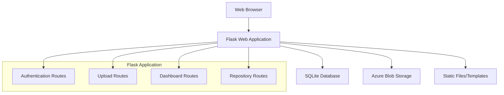

# Design Document

## Overview

The compliance document management system is a Flask-based web application that provides secure document upload, storage, and management capabilities. The system uses Azure Blob Storage for file storage, SQLite for user management and metadata, and features a clean, responsive web interface built with modern CSS frameworks.

## Architecture

### High-Level Architecture



### Technology Stack

- **Backend Framework:** Flask (Python)
- **Database:** SQLite (for development, Azure SQL Database ready)
- **File Storage:** Azure Blob Storage
- **Frontend:** HTML5, CSS3, JavaScript
- **CSS Framework:** Bootstrap 5 or Tailwind CSS
- **Authentication:** Flask-Login (session-based)
- **File Upload:** Flask file handling with Azure SDK

## Components and Interfaces

### 1. Authentication System

**Components:**
- User model for database operations
- Authentication service for login/logout
- Session management
- Password hashing utilities

**Interfaces:**
- `/login` - GET/POST for user authentication
- `/signup` - GET/POST for user registration
- `/logout` - POST for user logout

### 2. File Upload System

**Components:**
- File validation service
- Azure Blob Storage client
- Upload metadata handler
- Progress tracking (future enhancement)

**Interfaces:**
- `/upload` - POST for file upload
- File validation middleware
- Azure storage service interface

### 3. Document Repository

**Components:**
- Document metadata service
- Repository listing service
- Search and filter capabilities (future)

**Interfaces:**
- `/evidence-repository` - GET for document listing
- Document metadata API endpoints

### 4. Configuration Management

**Components:**
- Azure configuration handler
- Environment variable management
- Connection string validation

**Configuration Structure:**
```python
class Config:
    SECRET_KEY = os.environ.get('SECRET_KEY') or 'dev-secret-key'
    AZURE_STORAGE_CONNECTION_STRING = os.environ.get('AZURE_STORAGE_CONNECTION_STRING')
    AZURE_CONTAINER_NAME = os.environ.get('AZURE_CONTAINER_NAME') or 'compliance-documents'
    DATABASE_URL = os.environ.get('DATABASE_URL') or 'sqlite:///compliance.db'
    MAX_CONTENT_LENGTH = 16 * 1024 * 1024  # 16MB max file size
```

## Data Models

### User Model
```python
class User:
    id: int (Primary Key)
    email: str (Unique, Not Null)
    password_hash: str (Not Null)
    created_at: datetime
    is_active: bool (Default: True)
```

### Document Model
```python
class Document:
    id: int (Primary Key)
    filename: str (Not Null)
    original_filename: str (Not Null)
    blob_name: str (Unique, Not Null)
    file_size: int
    content_type: str
    uploaded_by: int (Foreign Key to User.id)
    uploaded_at: datetime
    is_active: bool (Default: True)
```

### Database Schema
```sql
-- Users table
CREATE TABLE users (
    id INTEGER PRIMARY KEY AUTOINCREMENT,
    email VARCHAR(120) UNIQUE NOT NULL,
    password_hash VARCHAR(128) NOT NULL,
    created_at DATETIME DEFAULT CURRENT_TIMESTAMP,
    is_active BOOLEAN DEFAULT 1
);

-- Documents table
CREATE TABLE documents (
    id INTEGER PRIMARY KEY AUTOINCREMENT,
    filename VARCHAR(255) NOT NULL,
    original_filename VARCHAR(255) NOT NULL,
    blob_name VARCHAR(255) UNIQUE NOT NULL,
    file_size INTEGER,
    content_type VARCHAR(100),
    uploaded_by INTEGER NOT NULL,
    uploaded_at DATETIME DEFAULT CURRENT_TIMESTAMP,
    is_active BOOLEAN DEFAULT 1,
    FOREIGN KEY (uploaded_by) REFERENCES users (id)
);
```

## User Interface Design

### Design Principles
- Clean, modern, professional appearance
- White/light color scheme for serious compliance work
- Responsive design for desktop and mobile
- Intuitive navigation and user flow
- Accessibility compliance (WCAG 2.1 AA)

### Layout Structure
```
Header/Navigation Bar
├── Logo/Brand
├── Navigation Menu
│   ├── Dashboard
│   ├── Evidence Repository
│   ├── AI Evidence (placeholder)
│   ├── Gap Analysis (placeholder)
│   ├── Audit Export (placeholder)
│   └── User Roles (placeholder)
└── User Actions (Login/Signup or User Menu)

Main Content Area
├── Page Title
├── Breadcrumb Navigation
└── Content Section

Footer
├── Copyright Information
└── Additional Links
```

### Color Scheme and Typography
- **Primary Colors:** Clean whites (#FFFFFF), light grays (#F8F9FA)
- **Accent Colors:** Professional blues (#0066CC, #E3F2FD)
- **Text Colors:** Dark grays (#212529, #6C757D)
- **Typography:** System fonts (San Francisco, Segoe UI, Roboto)
- **Spacing:** Consistent 8px grid system

### Page Layouts

#### Login/Signup Pages
- Centered form layout
- Clean card-based design
- Form validation feedback
- Professional branding

#### Dashboard
- Welcome message
- Quick upload section
- Recent activity summary
- Action buttons for common tasks

#### Evidence Repository
- Table/grid view of documents
- Search and filter options
- Sorting capabilities
- Pagination for large datasets

## Error Handling

### Client-Side Error Handling
- Form validation with real-time feedback
- File type and size validation before upload
- Network error handling with retry options
- User-friendly error messages

### Server-Side Error Handling
- Input validation and sanitization
- Azure service error handling
- Database error handling
- Logging for debugging and monitoring

### Error Response Format
```python
{
    "success": false,
    "error": {
        "code": "UPLOAD_FAILED",
        "message": "File upload failed. Please try again.",
        "details": "Connection to Azure Blob Storage failed"
    }
}
```

## Security Considerations

### Authentication Security
- Password hashing using werkzeug.security
- Session management with secure cookies
- CSRF protection for forms
- Rate limiting for login attempts

### File Upload Security
- File type validation (whitelist approach)
- File size limits
- Virus scanning (future enhancement)
- Secure file naming to prevent path traversal

### Data Protection
- HTTPS enforcement in production
- Secure Azure Blob Storage configuration
- Input sanitization and validation
- SQL injection prevention

## Testing Strategy

### Unit Testing
- User authentication functions
- File upload validation
- Azure Blob Storage operations
- Database operations

### Integration Testing
- End-to-end user workflows
- Azure service integration
- Database integration
- File upload complete flow

### UI Testing
- Responsive design testing
- Cross-browser compatibility
- Accessibility testing
- User experience validation

### Test Data Management
- Mock Azure services for testing
- Test database with sample data
- File upload test scenarios
- User authentication test cases

## Performance Considerations

### File Upload Optimization
- Chunked upload for large files (future)
- Progress indicators
- Asynchronous processing
- Client-side compression (future)

### Database Optimization
- Proper indexing on frequently queried fields
- Connection pooling
- Query optimization
- Pagination for large result sets

### Caching Strategy
- Static file caching
- Database query caching (future)
- CDN for static assets (future)

## Deployment Architecture

### Development Environment
- Local Flask development server
- SQLite database
- Azure Blob Storage (development container)
- Environment variables for configuration

### Production Considerations
- WSGI server (Gunicorn/uWSGI)
- Azure SQL Database migration path
- Azure App Service deployment
- Environment-specific configuration
- SSL/TLS certificates
- Monitoring and logging